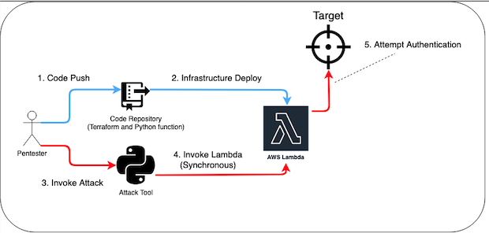

```
/*
 * Copyright 2023 Workday, Inc.
 *
 * This software is available under the MIT license.
 * Please see the LICENSE.txt file in this project.
 */
 ```

 

# CredStorm Sprayer - open source password spraying tool
A Workday-built tool which leverages AWS Lambdas to conduct password spray attacks. As most requests use a unique IP address, this can be used to bypass simple IP based detective controls.

This tool requires some setup in AWS (setting up Lambdas). To faciliate this, there is a terraform script which can be run to handle all configuration. Terraform only has to run once, after which, the client can be used freely.


# Terraform Usage
If you have already run this, or set up your lambdas manually, you can skip this section.

## Setup:
1. Clone this repository. 
2. Install latest version of requests in the `lambda` directory
```
cd terraform/lambda/
pip install requests -t .
```
4. Run the following commands to set up the terraform infrastructure:
```
cd terraform
terraform init
terraform plan -out sprayer
terraform apply sprayer
```


# Client Usage
Once AWS has appropriate lambdas, such as those setup by terraform, this section includes client usage details


## Usage:
```
usage: lambda_sprayer.py [-h] (-r FILE | --get URL) (--upl FILE | --ul FILE | -u TARGET USER) [--pl FILE] [-p TARGET PASSWORD] [-v]
                         [--proxy IP:PORT] [--insecure] [-c COUNT] [--no-banner] [-t THROTTLE]

options:
  -h, --help            show this help message and exit
  --upl FILE            User password list
  --get URL             Simple GET request
  --ul FILE             User list
  -u TARGET USER        Target User
  --pl FILE             User list
  -p TARGET PASSWORD    Target Password
  -r FILE               Request file
  -v, --verbose         Print detailed messages to stdout
  --proxy IP:PORT       Proxy address for testing. Disables Lambda
  --insecure            Disable TLS
  -c COUNT, --count COUNT
                        Number of lambdas to use
  --no-banner           Remove art from the output
  -t THROTTLE           Add minimum delay between requests
```

### Basic Request Files
This tool takes in a request file. You can manually create one of these, or you can get one from a tool such as BurpSuite, by right clicking and saving a request. When parsing the request, certain keywords are searched for, these are *PASSWORD* and *USERNAME* by default (all caps). These indicate the points you want to inject into. You do not need both of these, but you probably want at least one present in your request file.

You can change these keywords in the client script if you'd like.

### Specifying a Username or Password List
The tool takes in a list of usernames, passwords, or a colon-deliniated username/password list. It will create a unique request for each item in the list or combination of items if more than just a username or password are provided.

### Examples

#### basic spray with username and password file
``` python3 lambda_sprayer.py -r test_lists/sample_POST --ul test_lists/user_list.txt --pl test_lists/password_list.txt ```

#### same thing with un/pw list
``` python3 lambda_sprayer.py -r test_lists/sample_POST --proxy 127.0.0.1:8080 --upl test_lists/user_pass_list.txt ```

#### Introduce time delay (in seconds)
``` python3 lambda_sprayer.py -r test_lists/sample_POST --upl test_lists/user_pass_list.txt -t 10```

#### Time delay between requests using 5 Lambdas
``` python3 lambda_sprayer.py -r test_lists/sample_POST --upl test_lists/user_pass_list.txt -t 10 -c 5```

### Simple GET request
``` python3 lambda_sprayer.py --get "https://www.example.com:443/login/?username=USERNAME&password=PASSWORD" --upl test_lists/user_pass_list.txt```

#### Remove banner from output
``` python3 lambda_sprayer.py -r test_lists/sample_POST --upl test_lists/user_pass_list.txt --no-banner```

### Troubleshooting

#### Can't connect to an unencrypted server
Make sure to use the --insecure flag to downgrade to a non-TLS connection

#### Connection issues in test environmnet
When testing this out, make sure that Lambda has the ability to access your test server. In some situations, Lambda may be blocked.

#### Running slowly
By default, the count variable is set to 1, you should always update this to match the number of lambdas you deployed

#### Other Things
* Make sure that the USERNAME or PASSWORD identifiers have been input correctly
* Ensure that your config file matches your deployment region and profile

# Architecture:
The current architecture for this project can be seen in the following image:


